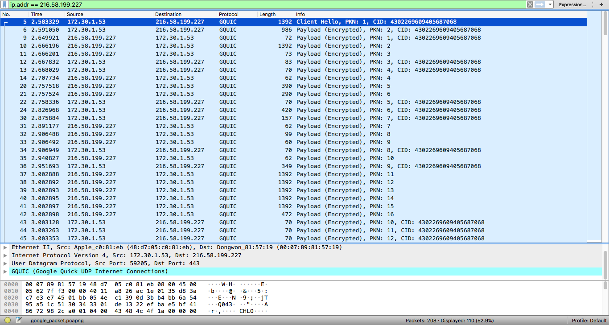
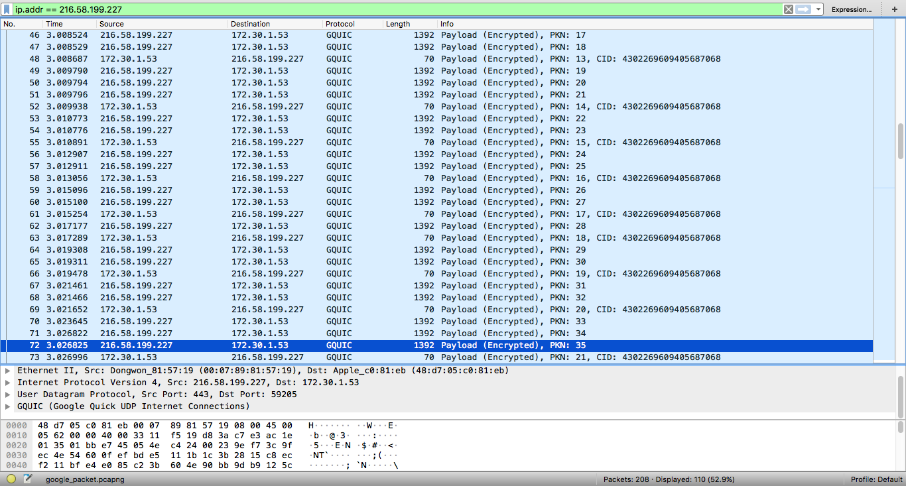
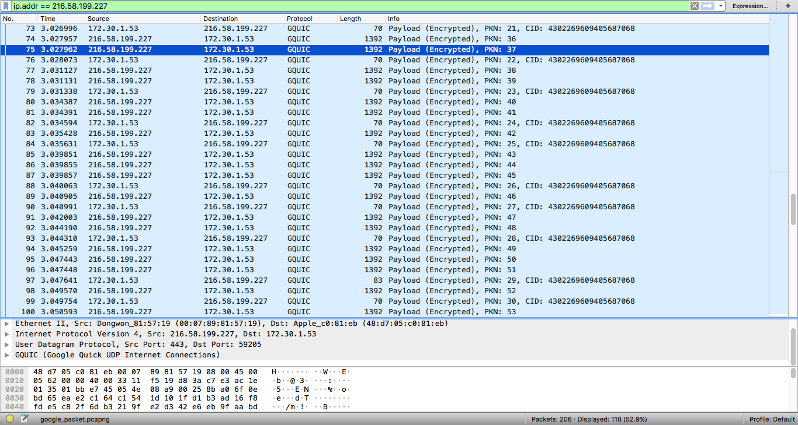
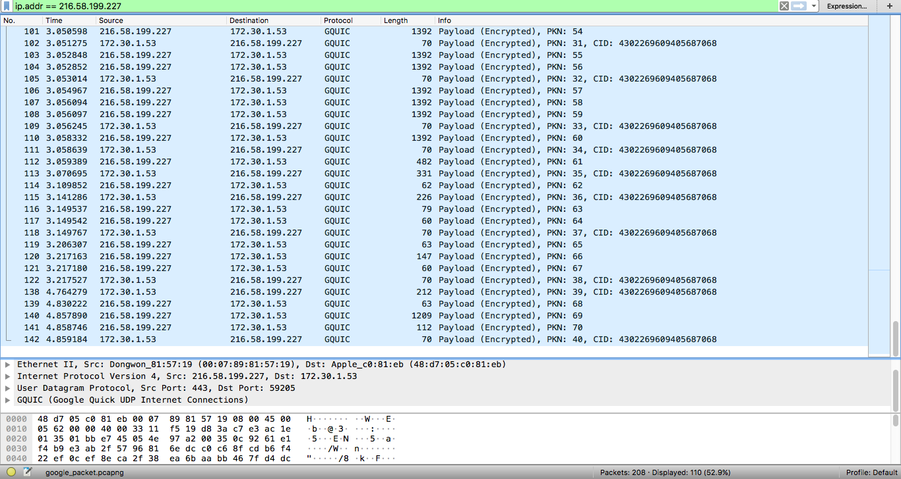

# Quest 09. What is server


## Introduction
* 이번 퀘스트에서는 인터넷이 어떻게 동작하며, 서버와 클라이언트, 웹 브라우저 등의 역할은 무엇인지 알아보겠습니다.

## Topics
* 서버와 클라이언트, 그리고 웹 브라우저
* 인터넷을 구성하는 여러 가지 프로토콜
  * IP
  * TCP
  * HTTP
* DNS

## Resources
* [OSI 모형](https://ko.wikipedia.org/wiki/OSI_%EB%AA%A8%ED%98%95)
* [IP](https://ko.wikipedia.org/wiki/%EC%9D%B8%ED%84%B0%EB%84%B7_%ED%94%84%EB%A1%9C%ED%86%A0%EC%BD%9C)
  * [Online service Traceroute](http://ping.eu/traceroute/)
* [TCP](https://ko.wikipedia.org/wiki/%EC%A0%84%EC%86%A1_%EC%A0%9C%EC%96%B4_%ED%94%84%EB%A1%9C%ED%86%A0%EC%BD%9C)
  * [Wireshark](https://www.wireshark.org/download.html)
* [HTTP](https://ko.wikipedia.org/wiki/HTTP)
  * Chrome developer tool, Network tab
* [DNS](https://ko.wikipedia.org/wiki/%EB%8F%84%EB%A9%94%EC%9D%B8_%EB%84%A4%EC%9E%84_%EC%8B%9C%EC%8A%A4%ED%85%9C)
  * [Web-based Dig](http://networking.ringofsaturn.com/Tools/dig.php)

## Checklist
* 인터넷은 어떻게 동작하나요? OSI 7 Layer에 입각하여 설명해 보세요.
    1. 1계층 - 물리 계층  
      물리 계층이라는 말 그대로 물리적인 부분이 다뤄진다. 네트워크 카드가 사용하는 케이블 종류, 데이터 송수신 속도 등의 표준을 정의한다. 관련 기기는 케이블, 리피터 등이 있다. 
    2. 2계층 - 데이터 링크 계층  
      이더넷이 송신 가능한 상태가 되는지 확인 후, 데이터를 전기 신호로 변환하여 물리 계층의 케이블로 보내는 단계이다. 
      이때, 전송되어 온 헤더 중 MAC 주소를 보고 해당 기기로 데이터를 전송하며, 보낼 때는 전송할 데이터를 프레임 단위로 나눠서 보낸다.
    3. 3계층 - 네트워크 계층  
      네트워크의 경로 설정 단계라고 할 수 있다. 도착해야 하는 곳에 데이터가 정확하게 도착할 수 있도록 이 단계에서 IP가 IP 헤더와 MAC 헤더를 부가하여 드라이버에 전달한다.
    4. 4계층 - 전송 계층  
      TCP가 송신 데이터를 패킷을 적합한 길이대로 분할하여 IP에 전달한다. 이때 분할된 패킷이 오류가 없는지 검사하는 방법을 덧붙여 패킷을 전달한다. (ACK 패킷이 같이 가는 것 등으로 확인할 수 있음)
    5. 5계층 - 세션 계층  
      인터넷의 논리적인 연결을 담당한다. 인증 및 지속적 연결과 같은 기능을 제공한다. TCP/IP 세션의 생성/제거도 맡고 있다.
    6. 6계층 - 표현 계층  
      MIME 인코딩, 암호화 등에 관한 동작이 이뤄진다. 즉, 데이터의 형식을 구분하거나 (해당 데이터가 텍스트 파일인지) 
      end to end의 차이에 따라 데이터의 형식을 변환해주어 (EBCDIC로 인코딩된 문서 파일을 ASCII로 변환) 7계층인 응용 계층의 부담을 덜어준다. 
    7. 7계층 - 응용 계층
      일반 사용자들이 네트워크를 사용할 수 있도록 해주는 창구 역할을 한다. (사용자는 url을 입력하여 특정 사이트로 이동할 수 있다. 이때 입력한 url을 받아서 이후 작업을 수행해줌) 
      즉, 네트워크 간의 연결과 실제 전송되어야 할 데이터를 생성하는 (HTTP 메시지) 역할을 한다.
      
* 우리가 브라우저의 주소 창에 www.knowre.com 을 쳤을 때, 어떤 과정을 통해 노리의 서버 주소를 알게 되나요?
    0. url을 입력하고 엔터를 치면
    1. 브라우저가 DNS가 기록되어 있는 4가지 다른 종류의 캐시를 뒤져서 url에 맞는 IP주소가 있는지 찾아본다.
    이를 통해 네트워크 트래픽을 조절하고 데이터 트랜스퍼 시간을 효율적으로 관리한다.
        1. 1단계 검색 대상은 browser cache. 이전에 방문했던 사이트를 일정 기간동안 보관해놓는다.
        2. 2단계 검색 대상은 OS cache. browser cache에서 결과를 못 찾은 경우, 브라우저는 OS 시스템에 시스템 콜을 날려 내역을 받아 찾아본다.
        3. 3단계 검색 대상은 router cache. 
        4. 4단계 검색 대상은 ISP cache.
    2. 캐시에서 아무것도 찾지 못했으면 ISP의 DNS 서버가 해당 url을 호스트하는 서버에 DNS 쿼리를 날린다.
    이때 해당 쿼리를 날리는 ISP의 DNS 서버는 DNS recursor라고 불린다. 이는 특정 도메인 네임에 매칭되는 IP주소를 찾을 때까지
    계속해서 다른 DNS 서버(=네임 서버)에 쿼리를 날린다. 이후, 네임 서버들은 도메인의 단계별로 해당 정보를 가지고 있는 네임 서버를 단계적으로 찾아 내려 가며
    마지막 단계까지 내려가서 IP주소를 찾았으면 이 결과를 DNS recursor에 전달한다. 그럼 DNS recursor는 이를 다시 브라우저로 전달해준다.
    이때 맞는 경로/더 효율적인 경로를 찾기 위해 라우팅 테이블이 사용되며, 이때 데이터 패킷을 잃어버리면 failed error를 얻게 된다.
    * 서버 주소를 알게 된 후 브라우저는
    3. 해당 서버와 TCP 커넥션을 establish한다.
        1. SYN 패킷을 해당 서버에 보내 새로운 커넥션이 가능한 상태인지 확인한다.
        2. 서버에서 ACK(nowledgement)/SYN 패킷을 답으로 보냄으로써 이를 수락하고 새로운 커넥션을 시작한다.
        3. 브라우저가 이를 받으면 다시 ACK 패킷을 보내 수신을 확인한다.
    4. 브라우저는 이제 이를 통해 HTTP 리퀘스트를 서버에 보낸다.
    5. 이를 받은 서버는 해당 리퀘스트를 핸들러에 전달하여 리퀘스트를 읽고 적합한 리스폰스를 생성한다. 리퀘스트 핸들러는 프로그래밍 언어로 작성된 프로그램으로써
    리퀘스트를 확인하고 필요한 경우 데이터를 업데이트하거나 요청받았던 데이터를 적합한 형식에 맞게 조립한다.
    6. 이제 서버가 HTTP response (요청했던 데이터/ 응답 상태 코드/ 컨텐츠 인코딩 타입/ 캐시 정책 등)를 보낸다.
    7. 브라우저는 이제 요청했던 데이터를 받아 렌더링한다. HTML 뼈대를 먼저 렌더하고, 필요한 tag를 확인한 다음 GET 리퀘스트를 다시 보내 
    추가로 필요한 엘리먼트 (CSS stylesheets, JS files, etc.)를 받아서 그 위에 렌더한다. (대게 이런 정적인 파일들은 캐시된다)
       
## Quest
* tracert(Windows가 아닌 경우 traceroute) 명령을 통해 www.google.com 까지 가는 경로를 찾아 보세요.
  * 어떤 IP주소들이 있나요?
    * ISP(인터넷 회선 제공 업체), 호스팅 업체, 방화벽 등을 지난다. 
  ```
  1	 	 	 	*	*	*
  
  			
  2	core21.fsn1.hetzner.com	213.239.245.237	de	0.333 ms	 	 
  core22.fsn1.hetzner.com	213.239.245.241	de	0.194 ms	 
  core21.fsn1.hetzner.com	213.239.245.237	de	0.333 ms
  
  			
  3	core4.fra.hetzner.com	213.239.245.14	de	5.036 ms	 	 
  core11.nbg1.hetzner.com	213.239.224.9	de	2.844 ms	 
  core12.nbg1.hetzner.com	213.239.245.214	de	2.751 ms
  
  			
  4	 	 	 	*	*	*
  
  			
  5	 	 	 	*	*	*
  
  			
  6	 	 	 	*	*	*
  
  			
  7	 	 	 	*	*	*
  
  			
  8	 	 	 	*	*	*
  No reply for 5 hops. Assuming we reached firewall.
  ```
  ```
    traceroute www.google.com
    traceroute to www.google.com (216.58.199.228), 64 hops max, 52 byte packets
     1  172.30.1.254 (172.30.1.254)  3.912 ms  0.961 ms  2.871 ms // giga wift 
     2  * * *
     3  168.126.227.213 (168.126.227.213)  38.659 ms  10.484 ms  6.032 ms
     4  112.190.49.41 (112.190.49.41)  4.983 ms  3.839 ms  4.754 ms
     5  112.190.32.153 (112.190.32.153)  8.291 ms  9.989 ms  6.365 ms // google
     6  * * *
     7  112.174.7.150 (112.174.7.150)  53.185 ms // google
        112.174.47.102 (112.174.47.102)  3.209 ms
        112.174.5.170 (112.174.5.170)  2.801 ms
     8  72.14.209.154 (72.14.209.154)  41.923 ms  70.536 ms  32.521 ms
     9  108.170.242.98 (108.170.242.98)  39.334 ms
        108.170.242.112 (108.170.242.112)  35.408 ms
        108.170.242.208 (108.170.242.208)  33.477 ms
    10  72.14.234.67 (72.14.234.67)  31.439 ms
        209.85.241.107 (209.85.241.107)  58.714 ms
        209.85.244.37 (209.85.244.37)  34.181 ms
    11  108.177.3.254 (108.177.3.254)  47.839 ms  55.104 ms
        108.170.231.180 (108.170.231.180)  39.252 ms
    12  108.170.243.97 (108.170.243.97)  44.348 ms
        108.170.243.129 (108.170.243.129)  42.319 ms  40.720 ms
    13  108.170.235.43 (108.170.235.43)  44.217 ms  53.993 ms
        108.170.235.45 (108.170.235.45)  64.863 ms
    14  kix05s02-in-f4.1e100.net (216.58.199.228)  48.339 ms  52.214 ms  142.993 ms
   ```
    
  * 그 IP주소들은 어디에 위치해 있나요?
    * 도메인 네임에 맞는 IP주소를 찾는 것은 DNS 서버를 통해 할 수 있고, 직접적으로 지나가는 물리적 위치를 말하는 것이라면 라우터라고 할 수 있다.
    라우터는 라우팅 테이블을 통해 계산된 최적 경로에 따라 위계적인 구조를 가지고 있다. 
  
* Wireshark를 통해 www.google.com 으로 요청을 날렸을 떄 어떤 TCP 패킷이 오가는지 확인해 보세요
   
   
   
   
  * TCP 패킷을 주고받는 과정은 어떻게 되나요?
    * TCP 패킷을 주고받았다면 SYN 패킷을 클라이언트에서 보내면 이를 받은 서버에서 ACK, SYN 패킷을 보내고, 클라이언트는 다시 ACK 패킷을 보내면서 데이터를 보냈을 것이다.
    * 구글은 TCP 프로토콜이 패킷을 주고 받는 횟수가 많아서 느리기 때문에 이를 위 이미지에서 보이는 것처럼 GQUIC 프로토콜로 대체했다.
    * GQUIC 프로토콜은 TCP 대신 UDP 프로토콜 위에 해당 프로토콜을 얹어 패킷 전송, HTTP 프로토콜의 일부분까지 수행한다. 
  * 각각의 패킷에 어떤 정보들이 담겨 있나요?
    * Frame: 도착 시간, 바이트 정보, 프레임 길이 등
    * Ethernet: Destination, Source, type 
    * Internet Protocol Version, Time to live, Source/Destination Port Num 등
  
* telnet 명령을 통해 http://www.google.com/ URL에 HTTP 요청을 날려 보세요.
  * 어떤 헤더들이 있나요?
  ```
  // connection open
  telnet www.google.com 80
  Trying 216.58.197.4...
  Connected to www.google.com.
  Escape character is '^]'.
  
  // GET method
  GET / HTTP/1.1
  ```
  ```
  // result 응답 헤더
  HTTP/1.1 200 OK
  Date: Mon, 15 Oct 2018 11:58:50 GMT
  Expires: -1
  Cache-Control: private, max-age=0
  Content-Type: text/html; charset=ISO-8859-1
  P3P: CP="This is not a P3P policy! See g.co/p3phelp for more info."
  Server: gws
  X-XSS-Protection: 1; mode=block
  X-Frame-Options: SAMEORIGIN
  Set-Cookie: 1P_JAR=2018-10-15-11; expires=Wed, 14-Nov-2018 11:58:50 GMT; path=/; domain=.google.com
  Set-Cookie: NID=141=BDrhQQOlpKYV1jAGlTQFRkZ4Q_h-w39ISyrOgKUwc7pRmEALdlZXD-pfDus4K8ryUrQKkoN-yR6wJ8iY86VNdUI48OPBsbZfcWOv5IKo_Vfm8IK1rwS-x1lC7g9GpdUX; expires=Tue, 16-Apr-2019 11:58:50 GMT; path=/; domain=.google.com; HttpOnly
  Accept-Ranges: none
  Vary: Accept-Encoding
  Transfer-Encoding: chunked
  ```
  * 그 헤더들은 어떤 역할을 하나요?
    * status line: HTTP 프로토콜의 버전과 요청 처리 상태값
    * Date: 응답 헤더를 보낸 일시
    * Expires: 캐시해둔 정보를 다시 체크해봐야 하는 만기 일시, 0 혹은 -1과 같은 시간이 아닌 숫자는 캐시 불가함을 나타냄
    * Cache-Control: 캐싱에 대한 상세한 디렉티브를 정해 놓은 부분이며, 'private'은 해당 응답이 단일 사용자를 위한 것이고, 공유 캐시에 저장되서는 안됌을 의미함
    max-age는 응답 시간을 기준으로 리소스가 최신 상태라고 판단할 수 있는 시간을 의미함
    * Content-Type: 보내는 데이터의 MIME type, 클라이언트는 이를 보고 데이터 형식을 판단하여 적절하게 렌더링함; charset은 문자 형식을 말함
    * P3P: Platform for Privacy Preferences라는 뜻으로 클라이언트와 서버 간의 프라이버시 정책을 관리하는 기준
    * Server: 요청을 처리하는 원 서버의 소프트웨어 정보; gws은 구글 서블릿 엔진 되시겠다
    * X-XSS-Protection: 스크립팅 공격으로부터 클라이언트를 보호할 수 있도록 XSS 공격을 필터링하는 부분; mode=block은 해당 부분을 제거하고 렌더링하는 수준이 아닌 페이지 로드 자체를 중단시키는 상세 설정 부분임
    * X-Frame-Options: `<frame>`, `<iframe>`, `<object>`에서 해당 페이지를 렌더링하게 할 것인지 여부를 선택하는 부분. 
    사이트 내 콘텐츠가 다른 사이트에 포함되지 않도록 해서 Clickjacking 공격에 사용되거나 당하지 않도록 함;
    SAMEORIGIN 값은 `<frame>`에 포함된 페이지가 그 페이지를 제공하는 사이트와 동일한 경우 허용함을 의미함
    * Set-Cookie: 쿠키 저장과 관련된 부분. expire은 언제 해당 쿠키값이 만료될지를 나타내며, path, domain은 쿠키의 스코프를 나타냄. path에 `/example`라고 되어 있다면 저장된 도메인에는 항상 해당값이 들어가야 함.
    예를 들어 `google.com/example`, `google.com/example/drive`, `google.com/example/mail` 뭐 이런 식으로 sub 경로에 반드시 포함되어 있어야 한다. 
    HttpOnly는 XSS 공격을 방지하는 것과 관련있는 설정 부분으로 해당 키워드가 있을 경우, 그 쿠키는 `document.cookie` API에 접근이 불가하며 서버에 전송만 가능함

## 참고
* 터미널에서 IP주소 확인: `nslookup`
* [What happens when you type an URL in the browser and press enter?](https://medium.com/@maneesha.wijesinghe1/what-happens-when-you-type-an-url-in-the-browser-and-press-enter-bb0aa2449c1a)
