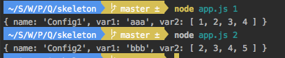

# Quest 10. Hello, node.js


## Introduction
* 이번 퀘스트에서는 node.js의 기본적인 구조와 개념에 대해 알아 보겠습니다.

## Topics
* 꼭 알아야 하는 것들
  * node.js
  * npm
  * `require()` 함수
  * module.exports

## Resources
* [Node.js 노드제이에스 프로그래밍](http://www.yes24.com/24/Goods/6271069?Acode=101), 에이콘출판사
* [모던 웹을 위한 Node.js 프로그래밍](http://www.yes24.com/24/Goods/10991708?Acode=101), 한빛미디어

## Checklist
* node.js는 어떤 식으로 동작하나요?
  * `require()` 함수는 어떻게 쓰는 것인가요?
    * `let bar = require('foo.js');` 처럼 필요한 메소드를 담고 있는 js 파일을 불러오는 역할을 한다. 이처럼 변수에 할당해놓고, 
    변수를 통해서 내부에 있는 어떤 메소드든 접근하여 프로그래밍할 수 있다.
    * 메소드뿐 아니라 변수, 클래스 등 export한 것은 모두 사용할 수 있다.
    * export한 파일 뿐 아니라 `http`, `request` 등과 같은 빌트인 모듈도 불러서 쓸 수 있다.
  * `module.exports`와 `exports` 변수는 어떻게 다른가요?
    * node.js에서 export되는 객체는 `module.exports`이며, `exports`는 `module.exports`를 가르키는 변수이다.
    * 또한, export될 때 `module.exports`는 항상 빈 객체로 초기화되어 있다. 즉, `module.exports = {}` 상태.
    * 따라서 사용법이 달라진다.
      * `module.exports`는 객체 자체를 할당한다. 객체를 통으로 exports 시키는 방식이다.
        ```node.js
        module.exports = {
        title: 'A star is born';
        genre: 'Drama';
        }
        ```
      * `exports`는 객체를 참조하는 변수이므로, 참조하는 객체에 프로퍼티를 추가하는 방식으로 사용한다. 여기에 객체 자체를 할당할 경우,
      더 이상 module.exports를 참조하지 않으므로 에러 발생!  
        ```javascript
        exports.title = 'A star is born';
        exports.genre = 'Drama';
        ``` 
  
* npm이 무엇인가요?
  * Node Package Manager의 준말로 말 그대로 패키지 관리자. 가장 큰 오픈소스 중 하나이기도 하다. 이를 통해 프로젝트마다 패키지 설치 및 호환성 관리 등을 편리하게 할 수 있다.
  * npm 패키지를 `-g` 옵션을 통해 Global로 저장하는 것과 그렇지 않은 것은 어떻게 다른가요?
    * `-g` 옵션 사용시에는 시스템 디렉토리에 패키지가 설치되기 때문에 해당 프로젝트 위치에 있지 않아도 어디서든 접근이 가능하다.

## Quest
* node.js를 PC에 설치해 보세요. 버전은 LTS라고 써 있는 버전이 적당합니다.
* 커맨드 라인에서 다음과 같은 명령을 쳤을 때 위 파일들의 내용이 나타나도록 해 보세요.
  * `$ node app.js 1`
    * `{ name: 'Config1', var1: 'aaa', var2: [ 1, 2, 3, 4 ] }`
  * `$ node app.js 2`
    * `{ name: 'Config2', var1: 'bbb', var2: [ 2, 3, 4, 5 ] }`
    
* 단, 주어진 스켈레톤 코드에서 app.js는 변경할 수 없으며, 새로운 파일을 추가해야 합니다.

## 참조
[exports와 module.exports 차이점](http://happinessoncode.com/2018/05/20/nodejs-exports-and-module-exports/)
