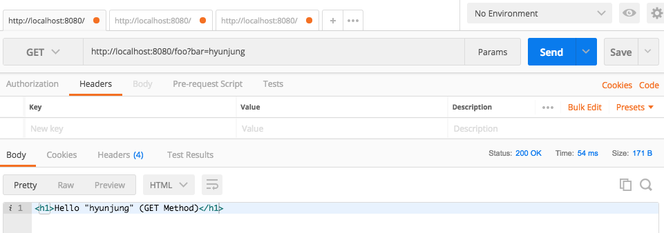
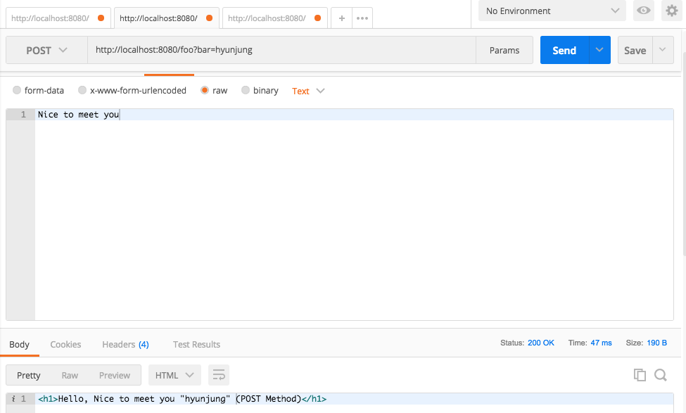
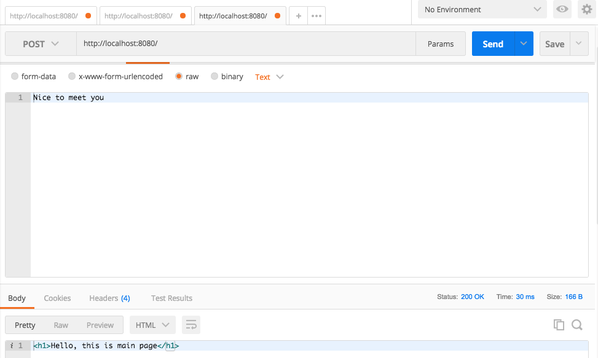

# Quest 11. My little web server


## Introduction
* 이번 퀘스트에서는 간단한 웹서버를 만들어 보겠습니다.

## Topics
* GET/POST
* node.js `http` module
  * `req`와 `res` 객체

## Resources
* [HTTP Node.js Manual & Documentation](https://nodejs.org/api/http.html)
* [Postman](https://chrome.google.com/webstore/detail/postman/fhbjgbiflinjbdggehcddcbncdddomop)

## Checklist
* HTTP의 GET과 POST 메소드는 어떻게 다른가요?
  * `GET`: 서버로부터 리소스를 받고자 할 때 사용하는 메소드. CRUD 중 Read에 매칭되는 메소드라고 할 수 있다. 
  매개변수는 쿼리스트링으로만 보낼 수 있기 때문에 길이의 제한도 있고, 보안상의 문제도 존재한다. 
  * `POST`: 클라이언트에서 서버로 리소스를 보낼 때 사용하는 메소드. 주로 새로운 값을 등록할 때 활용한다. (블로그의 새 글같은) CRUD 중 Create에 매칭되는 메소드.
  `GET`과 달리 body에 어떤 내용이든 넣어서 보낼 수 있기 때문에 형식/길이 제한으로부터 자유롭고, 보안 측면에서도 훨씬 우수하다.
  * 다른 HTTP 메소드에는 무엇이 있나요?
    * `PUT` / `PATCH`: 마찬가지로 클라이언트에서 서버로 리소스를 보낼 수 있다. CRUD 중 Update를 할 때 사용하며, 전달한 리소스로 원래 리소스를 변경할 수 있다.
    단, `PUT`은 전체 리소스를 새로운 리소스로 업데이트하고, `PATCH`는 리소스의 부분만 수정한다는 차이점이 있다.
    * `DELETE`: 서버에서 특정 리소스를 삭제할 수 있다. 
* HTTP 서버에 GET과 POST를 통해 데이터를 보내려면 어떻게 해야 하나요?
  * `GET`을 활용할 때는 url의 쿼리스트링 부분에(?이하) key=value 형식으로 넣어 보낸다. `POST`의 경우, req body에 넣어서 보내면 된다.
      ```
      // GET의 경우
      GET /?example=wonderful&this=that HTTP/1.1
      Host: www.google.com
      ```
      ```
      // POST의 경우
      POST / HTTP/1.1
      Host: www.google.com
      Content-Type: text/html
      Content-Length: 358
      
      
      <html>
      (..) 
     ```
  * HTTP 요청의 `Content-Type` 헤더는 무엇인가요?
    * 리소스의 MIME type을 알려주는 부분. text, img, video, audio, application 등의 type이 있음.
  * Postman에서 POST 요청을 보내는 여러 가지 방법(`form-data`, `x-www-form-urlencoded`, `raw`, `binary`) 각각은 어떤 용도를 가지고 있나요?
    * `form-data`: form 양식으로 데이터를 보내는 것과 같다. key, value 쌍으로 작성하여 보낼 수 있고, 파일도 첨부할 수 있다.
    * `x-www-form-urlencoded`: url에 parameter로 넣어서 보내는 것 과 같다. key, value 쌍으로 작성하여 보낼 수 있다. 
    * `raw`: 어떤 것을 보내도 상관없다, Postman은 환경변수를 제외하면 그 어떤 것도 변형하지 않고 req body로 그대로 보낸다. 
    단, JSON(application/json)처럼 세부 형식을 지정하면 syntax highlighting 기능을 활용할 수 있으므로 참고. 
    * `binary`: img, audio, video 파일처럼 텍스트로 작성할 수 없는 파일을 `binary`를 통해 보낼 수 있다.
  
## Quest
* 다음의 동작을 하는 서버를 만들어 보세요.
  * 브라우저의 주소창에 `http://localhost:8080`을 치면 `Hello World!`를 응답하여 브라우저에 출력하는 서버를 만들어 보세요.
  * 서버의 `/foo` URL에 `bar` 변수로 임의의 문자열을 GET 메소드로 보내면, `Hello, [문자열]`을 출력하는 서버를 만들어 보세요.
  
  
  * 서버의 `/foo` URL에 `bar` 변수로 임의의 문자열을 POST 메소드로 보내면, `Hello, [문자열]`을 출력하는 서버를 만들어 보세요.
  
  
  * `/`인 경우
  

* expressJS와 같은 외부 프레임워크를 사용하지 않고 만들어 보세요.
